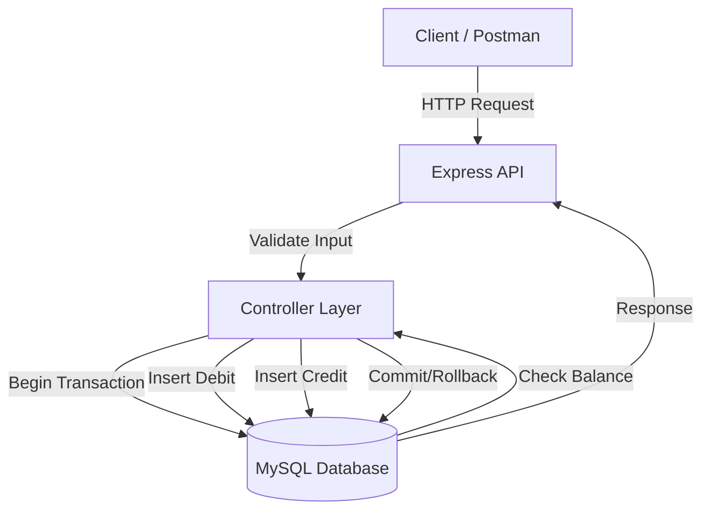
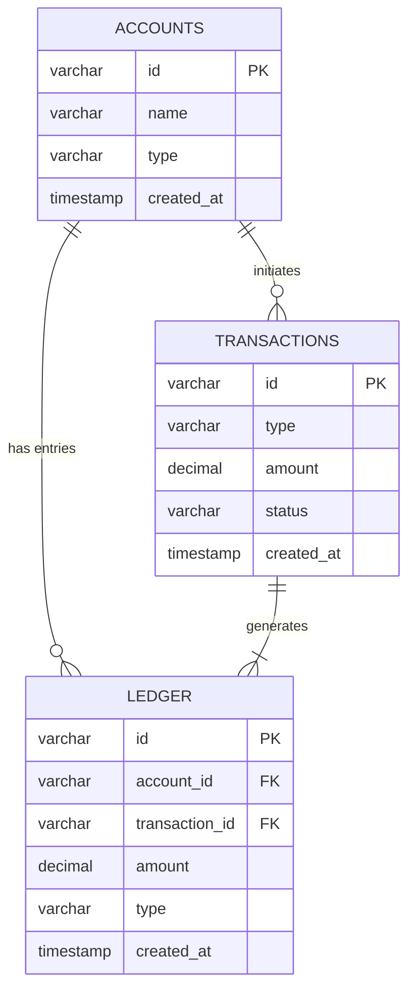

# Financial Ledger API 💰

A robust Banking REST API built with **Node.js** and **MySQL**. This project implements **Double-Entry Bookkeeping** principles to ensure absolute data integrity, immutable transaction history, and accurate balance calculations.

## 🚀 Features

* **Double-Entry Ledger:** Every transfer records a debit and a credit entry.
* **ACID Transactions:** Uses MySQL transactions to ensure operations are atomic (all or nothing).
* **Immutable Data:** Ledger entries cannot be updated or deleted, providing a secure audit trail.
* **Real-time Balance:** Balances are calculated on-the-fly by aggregating ledger history.
* **Data Integrity:** Prevents overdrafts and ensures valid transaction states.

## 🛠️ Tech Stack

* **Node.js & Express** - Backend Framework
* **MySQL (InnoDB)** - Relational Database
* **UUID** - Unique IDs for accounts and transactions
* **Body-Parser** - Request parsing

---

## 🏗️ Architecture & Design

### Architecture Diagram

The application follows a layered MVC-style architecture where the Controller handles requests and the Service layer manages transaction atomicity.



### Database Schema (ERD)

We use a relational model with strict foreign keys to ensure data consistency.



## 🧠 Design Decisions

### 1. Double-Entry Bookkeeping

To ensure money is never created or destroyed, every `transfer` operation generates two distinct rows in the `ledger` table:

* **Debit:** Negative amount linked to the source account.
* **Credit:** Positive amount linked to the destination account.
The sum of these two entries is always 0.

### 2. ACID Compliance

We use the **InnoDB** storage engine which supports full ACID transactions.

* **Atomicity:** We wrap the `INSERT` statements (Debit + Credit + Transaction Record) inside a `BEGIN...COMMIT` block. If any step fails (e.g., database constraint), `ROLLBACK` is triggered.
* **Consistency:** Foreign keys ensure ledger entries always relate to valid accounts.

### 3. Isolation Level

We rely on MySQL's default **REPEATABLE READ** isolation level.

* **Rationale:** This level prevents "Dirty Reads" (reading uncommitted data) and "Non-Repeatable Reads". This ensures that if we check a balance at the start of a transaction, it remains consistent throughout the operation, preventing race conditions where two simultaneous transfers might spend the same money.

### 4. Balance Calculation & Negative Balance Prevention

* **Calculation:** We do not store a "current balance" column. Instead, `SELECT SUM(amount)` is run against the ledger. This avoids the "drift" issue where a cached balance gets out of sync with history.
* **Prevention:** Before any debit is inserted, we query the sum of the ledger. If `(Current Sum - Withdrawal Amount) < 0`, the transaction is strictly rejected with a `422 Unprocessable Entity` error.

---

## ⚙️ Setup Instructions

### 1. Clone the Repository

```bash
git clone https://github.com/Srikar-jayanthi/financial-ledger.git
cd financial-ledger
```

### 2. Install Dependencies

```bash
npm install
```

### 3. Database Configuration

1. Open **MySQL Workbench**.
2. Create a database named `ledger_db`.
3. Run the SQL script found in `schema.sql` to create the tables.

### 4. Configure Application

Open `server.js` and update the database connection password:

```javascript
const pool = mysql.createPool({
    host: 'localhost',
    user: 'root',
    password: 'YOUR_MYSQL_PASSWORD', // <--- Update this
    database: 'ledger_db',
    // ...
});
```

### 5. Run the Server

```bash
node server.js
```

The API will run on `http://localhost:3000`.

---

## 📡 API Endpoints

### 1️⃣ Create Account

**POST** `/accounts`

```json
{
  "name": "Srikar",
  "type": "Savings"
}
```

### 2️⃣ Get Balance

**GET** `/accounts/{accountId}`

### 3️⃣ Deposit Funds

**POST** `/deposits`

```json
{
  "accountId": "YOUR_ACCOUNT_ID",
  "amount": 5000
}
```

### 4️⃣ Transfer Money (Internal)

**POST** `/transfers`

```json
{
  "sourceAccountId": "SENDER_ID",
  "destAccountId": "RECEIVER_ID",
  "amount": 1000
}
```

### 5️⃣ View Statement (Ledger)

**GET** `/accounts/{accountId}/ledger`
